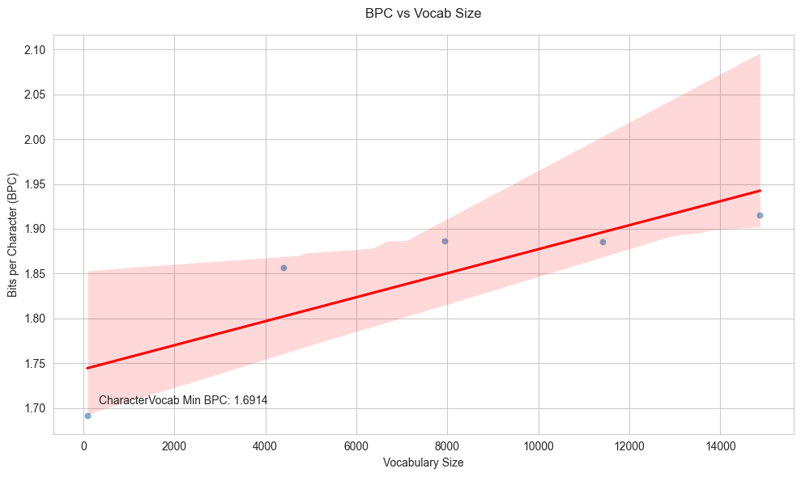

This experiment incremet vocabulary size with magicab and train from-scratch a LLM on bigger and bigger vocabularies. We observe a linear increase in BPC as vocabulary size increases. 

# Plot 

# Conclusion

From-scratch training on bigger vocabularies trades off BPC for more concise representations. 