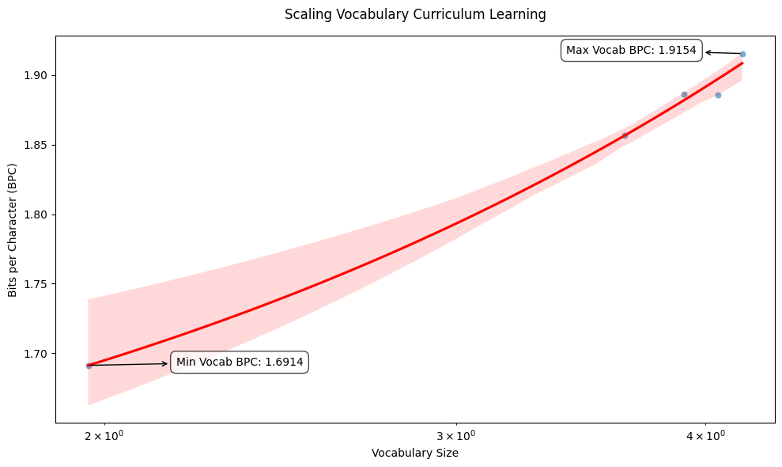

This experiment curriculum learning via scaling up vocabulary size from 92 to 14k. Continuously training the transformer blocks with the GPT, while adding to embedding and projection weights. Compared to naive baseline on 14k vocab, BPC improves from 8.9 to 1.9. 

# Plot 

# Conclusion

From-scratch training on bigger vocabularies trades off BPC for more concise representations. 
