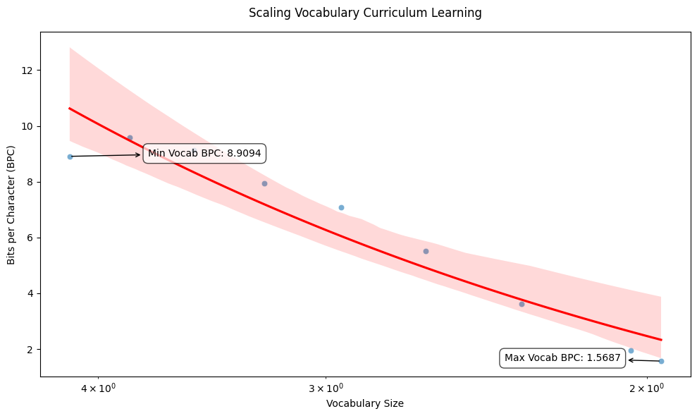

This experiment curriculum learning via scaling down vocabulary size from 14k to 92. Continuously training the transformer blocks with the GPT, while removing un-used embedding and projection weights. Compared to naive baseline on 92 vocab, BPC improves from 1.7 to 1.58. 

# Plot 

# Conclusion

From-scratch training on bigger vocabularies trades off BPC for more concise representations. 
